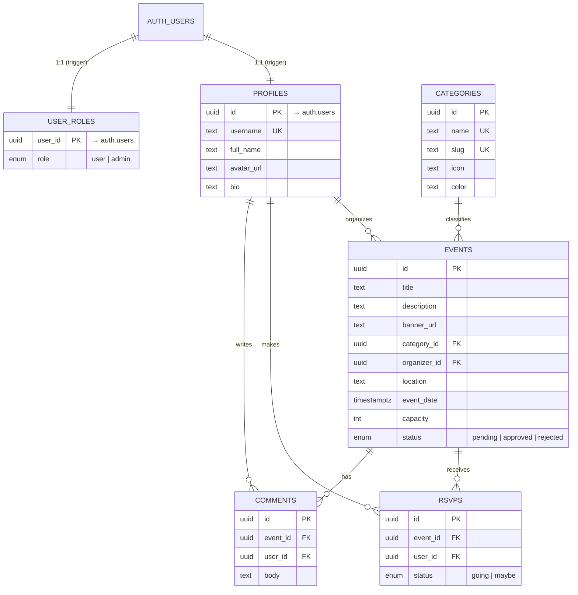

# 🎉 Eventide

> A community **event listings platform** — discover, host and RSVP to local events.

Eventide is the capstone project for the SoftUni **"Software Technologies with AI"**
course: a fully functional, multi-page JavaScript application backed by Supabase,
built with an AI-assisted development workflow.

- **Author:** Veselin Gerenski
- **Email:** veselingerenski@gmail.com
- **GitHub Repo:** https://github.com/VeselinGerenski/AI-development-July-2026
- **Live Project URL:** https://radiant-boba-6d5bcc.netlify.app
- **Sample credentials:** _added with demo data (Day 3)_ — e.g. `demo@eventide.app` / `demo12345`

---

## 1. Project description

Eventide lets communities find and organize events (concerts, meetups, workshops…).

| Role | What they can do |
| --- | --- |
| **Visitor** (not logged in) | Browse & search approved events, filter by category, view event details, organizers and attendee counts |
| **User** (registered) | Everything a visitor can, plus: create / edit / delete their own events (with banner image upload), RSVP (going/maybe), comment, edit their profile & avatar |
| **Admin** | Everything a user can, plus the **admin panel**: approve/reject submitted events, manage categories, and promote/revoke other admins |

New events are submitted as **pending** and only become public once an **admin approves** them — a real moderation workflow enforced at the database level.

## 2. Features & screens

The app has **9 screens**, each in its own module under `src/pages/`:

1. **Home / Browse** — hero + event grid with live search & category filters
2. **Login**
3. **Register**
4. **Event detail** — banner, description, RSVP, attendee avatars, comments
5. **Create event** — form + banner upload
6. **Edit event**
7. **My Events dashboard** — events I host (with status) + events I'm attending
8. **Profile** — edit name/bio + avatar upload
9. **Admin panel** — moderation, categories, users

Plus a styled **404** page. The UI is fully **responsive** (mobile-first Bootstrap), with icons, gradient accents, hover effects, loading/empty/error states, toasts, keyboard focus rings and `prefers-reduced-motion` support.

## 3. Architecture

**Client–server** architecture: a static JavaScript frontend talks to **Supabase**
over its REST API (via `@supabase/supabase-js`). There is no custom server.

```
┌─────────────────────────────────────────────┐        ┌──────────────────────────┐
│  Browser (Vite build, vanilla JS + Bootstrap)│        │  Supabase                │
│                                              │        │                          │
│  pages/  ──►  services/  ──►  supabaseClient ├──REST──►  Postgres  (RLS)         │
│   (UI)        (data access)                  │  +JWT  │  Auth      (JWT)         │
│  components/  utils/   router (hash-based)   │        │  Storage   (buckets)     │
└─────────────────────────────────────────────┘        └──────────────────────────┘
```

**Strict layering** (enforced by the agent instructions):

- `src/pages/` — one file per screen; each exports `async render(ctx) → HTMLElement`.
- `src/components/` — reusable UI (navbar, footer, event card, event form, avatar, spinner, toast).
- `src/services/` — the **only** modules that call Supabase (auth, events, rsvps, comments, categories, storage, admin). Pages never touch Supabase directly.
- `src/utils/` — DOM helpers, formatters, route guards.
- `src/router.js` — a lightweight **hash router**; multi-page navigation, one URL per screen.
- `supabase/migrations/` — versioned SQL (schema, RLS, storage, grants, seed).

### Tech stack

| Layer | Technology |
| --- | --- |
| Frontend | Vanilla JavaScript (ES modules), HTML5, CSS3, Bootstrap 5, Bootstrap Icons |
| Build | Node.js, npm, Vite |
| Backend | Supabase — Postgres, Auth (JWT), Storage, Row-Level Security |

_No TypeScript, no React/Vue/Angular, no jQuery — per the assignment._

## 4. Database schema

Six tables with relationships and indexes. Access is governed entirely by
**Row-Level Security**; admin actions are gated by a `public.is_admin()` helper.



**Key rules baked into the schema (`supabase/migrations/`):**

- `handle_new_user()` trigger auto-creates a `profiles` row **and** a `user_roles`
  row (default `user`) whenever someone registers.
- `is_admin()` (SECURITY DEFINER) powers admin RLS policies without recursion.
- `guard_event_status()` trigger stops non-admins from changing an event's
  moderation `status` (anti-privilege-escalation).
- `set_updated_at()` keeps `updated_at` fresh.
- Unique `(event_id, user_id)` on `rsvps` → one RSVP per user per event.

### Security model (RLS highlights)

- Events: `approved` are public; organizers see their own (any status); admins see all.
- Users can only insert/update/delete rows they own (`auth.uid() = user_id`).
- Categories & role changes are **admin-only**.
- Storage: two public buckets (`event-banners`, `avatars`); users may only write to
  their own `"<uid>/…"` folder.

## 5. Project structure

```
.
├── index.html                  # single entry (hash-routed app)
├── vite.config.js
├── .env.example                # Supabase credentials template
├── .github/
│   └── copilot-instructions.md # AI agent context & architectural rules
├── supabase/
│   ├── config.toml
│   ├── README.md               # how to apply migrations
│   └── migrations/             # versioned SQL (committed)
│       ├── 20260710120000_initial_schema.sql
│       ├── 20260710120100_rls_policies.sql
│       ├── 20260710120200_storage_buckets.sql
│       ├── 20260710120300_seed_categories.sql
│       └── 20260710120400_api_grants.sql
└── src/
    ├── main.js                 # app bootstrap (session → navbar → router)
    ├── router.js               # hash router
    ├── routes.js               # route table (path → page module)
    ├── session.js              # global auth/session store
    ├── supabaseClient.js       # single Supabase client
    ├── pages/                  # one file per screen
    ├── components/             # navbar, footer, eventCard, eventForm, avatar, spinner, toast
    ├── services/              # authService, eventService, rsvpService, commentService, categoryService, storageService, adminService
    ├── utils/                  # dom, format, guards
    └── styles/                 # theme.css (design system) + main.css (layout)
```

## 6. Local development setup

**Prerequisites:** Node.js 18+ and npm, plus a free [Supabase](https://supabase.com) project.

```bash
# 1. Install dependencies
npm install

# 2. Configure Supabase credentials
cp .env.example .env
#   then set VITE_SUPABASE_URL and VITE_SUPABASE_ANON_KEY
#   (Supabase dashboard → Project Settings → API)

# 3. Apply the database migrations
#   Option A: paste each file in supabase/migrations/ into the Supabase SQL Editor (in order)
#   Option B (CLI): supabase link --project-ref <ref> && supabase db push
#   See supabase/README.md for details.

# 4. Turn OFF "Confirm email" (Auth → Sign In / Providers → Email) for instant demo logins.

# 5. Run the dev server
npm run dev            # http://localhost:5173

# 6. Production build / preview
npm run build
npm run preview
```

**Make yourself an admin** (after registering), in the SQL Editor:

```sql
update public.user_roles set role = 'admin'
where user_id = (select id from public.profiles where username = 'YOUR_USERNAME');
```

## 7. Deployment

Static Vite build (`dist/`) deploys to any static host (Netlify / Vercel).
Set the two `VITE_SUPABASE_*` environment variables in the host's dashboard.
Build command `npm run build`, publish directory `dist`.

## 8. AI-assisted development

Built iteratively with an AI dev agent (prompt → implement → test → refine →
commit). Project-wide context and guardrails for the agent live in
[`.github/copilot-instructions.md`](.github/copilot-instructions.md). The full
[commit history](https://github.com/VeselinGerenski/AI-development-July-2026/commits)
reflects the day-by-day build.

## License

MIT
